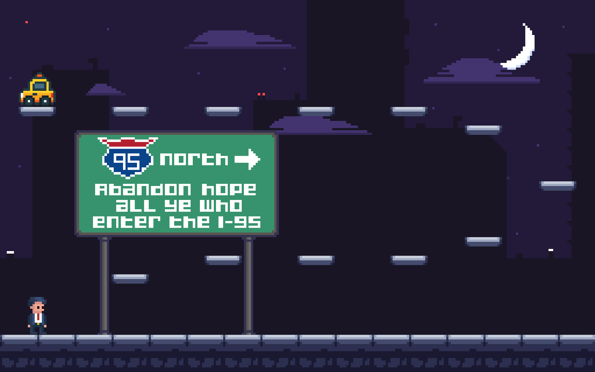
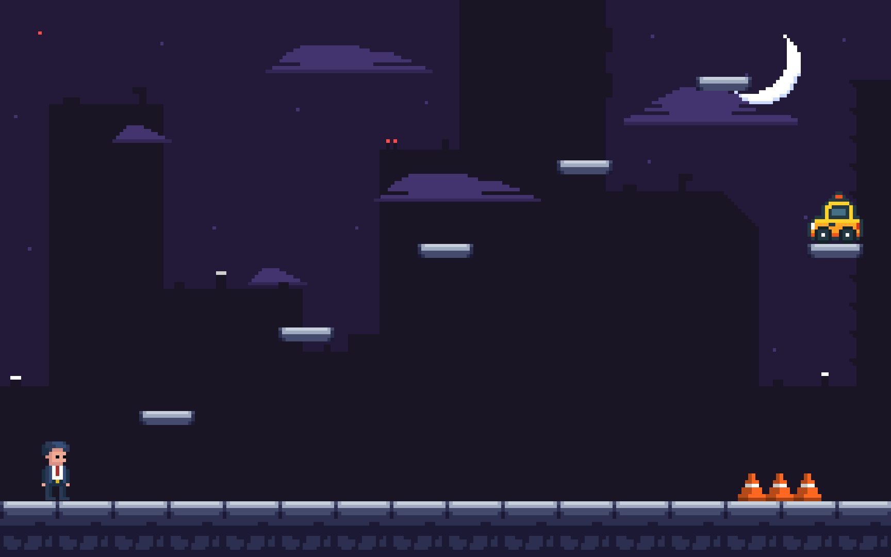
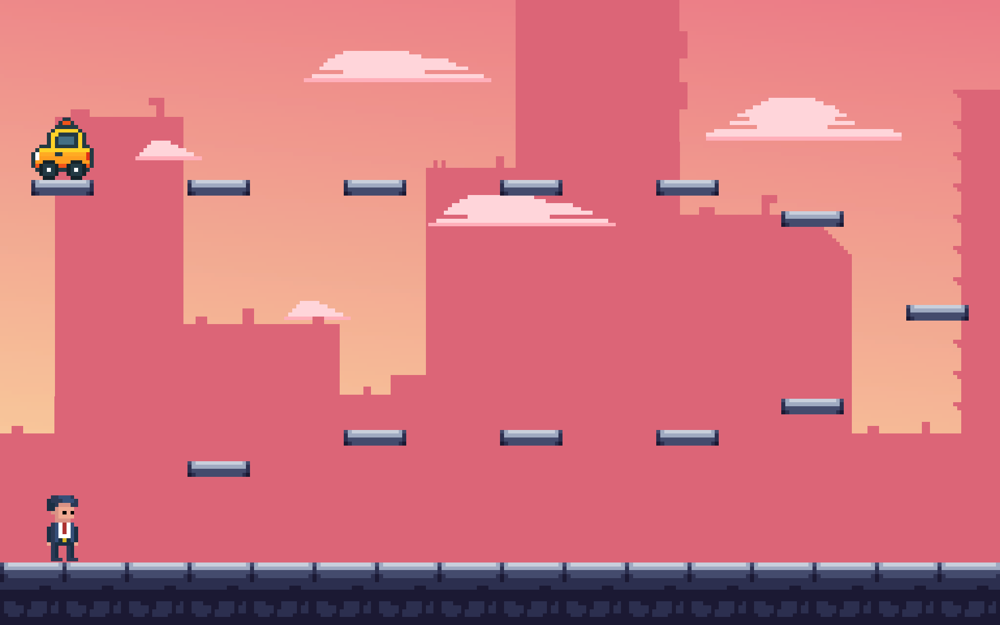
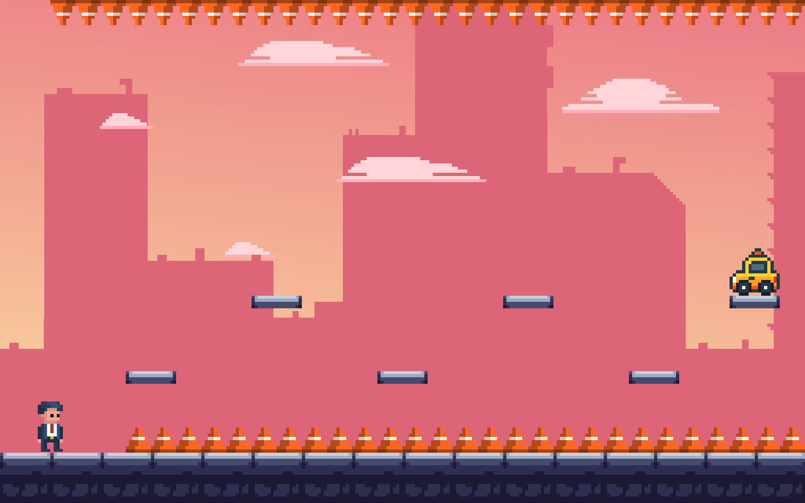
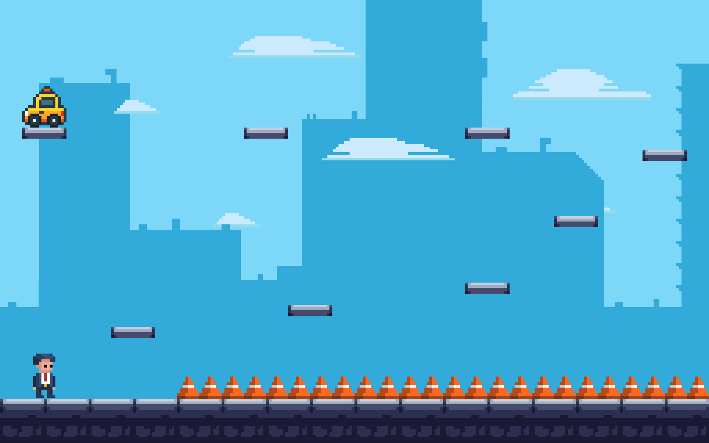

# Abstract
The World's Easiest Platformer is a perfectly ordinary platformer… probably. Like the name says, it's the easiest platformer you will ever play. It has levels, platforms, a jump button, all the usual stuff you would expect. There's absolutely nothing weird about this game, and this abstract would never ever lie to you about that. Ever. Probably.

Run and jump around as a business man in a suit as you play through 10 very normal levels, none of which will do anything unexpected. We definitely did not spend a godawful amount of time setting traps in the levels that would read you like a book. Like making disappearing platforms. Or reversing gravity. Or make you play Flappy Bird... probably.

We're not jerks though, so progress will be automatically saved when you complete a level, in case you need to take a break from ~~the rage induced by our traps~~ the overwhelming awesomeness of these levels! We also have sprites, sounds effects, and background music to ~~taunt you while you suffer~~ enhance your experience! Probably. If you don't like pixel art or 8-bit style music and sounds, we're sorry for your bad tastes.

Basically, please play our game. We guarantee you'll have a ~~miserable~~ great experience!

# Screenshots

  
  
  
  
  
  

# Video Demo

  <iframe src="https://www.youtube.com/embed/Qskm9MTz2V4" allowfullscreen="true"> </iframe>

# Team Profile

  
  

    <h2>
      Thanh Nguyen - Programmer and Level Designer
    </h2>
    

      Thanh Nguyen (Thành) is a student at George Mason University majoring in both Computer Science and Math.
      He loves all things related to video games, including playing them and making them. With his limited
      art skills, he prefers to work on the programming and design side of things. Besides games, he also
      has a vested interest in math, specifically pure math and theoretical computer science.
    

  

  
  

    <h2>
      Jung Chang - Programmer and Coordinator
    </h2>
    

      Jung Chang is a student at George Mason University majoring in Computer Science. He enjoys working on both gameplay programming
      and application logic, especially in projects where he can refine user experience and optimize performance.
      Outside of coding, Jung is passionate about video games—both playing and creating them—and loves exploring
      how game mechanics, balance, and design choices shape the player experience. 
    

  

  
  

    <h2>
      Joey Bourgeois - Artist and Sound Designer
    </h2>
    

      Joey Bourgeois is a CS major at GMU. Known colloquially as "The Mash Slinging Hasher" for a certain
      potato related incident. Hobbies include: playing video games, making video games and talking in the 3rd person.
    

  

# Third-Party Assets
All visual art (sprites and background) are custom-made by the team's artist.
All music by Jeremy Crockett for Omnibus, a game by Buddy Cops LLC and published by Devolver Digital.
Jump, jetpack, menu slect, and death sound effects are generated with bfxr.net
Invert gravity sound: https://pixabay.com/sound-effects/instant-teleport-90645
Fake taxi clown honk sound: modified from https://pixabay.com/sound-effects/horn-430368
Car unlock sound: https://pixabay.com/sound-effects/old-maruti-car-unlock-sound-keyless-entry-beep-327691
